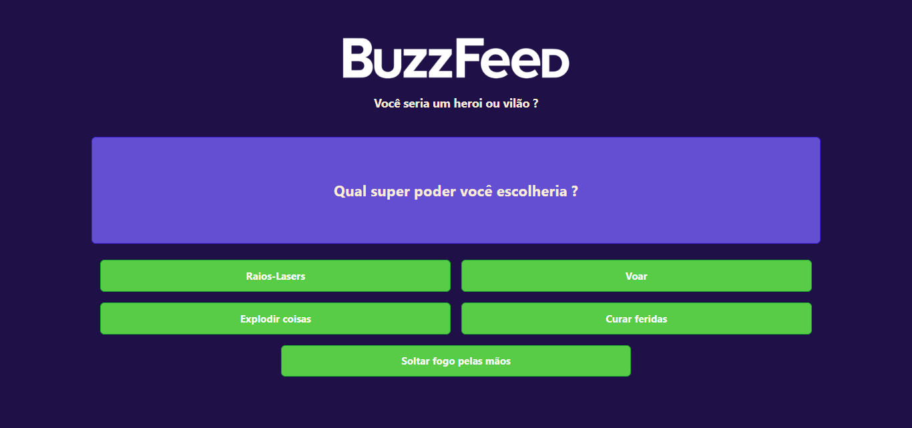

<h1 align="center"> BuzzFeed </h1>

Projeto do Bootcamp Coding The Future Banco PAN - Desenvolvimento Frontend com Angular

  <a href="#-tecnologias">Tecnologias</a>&nbsp;&nbsp;&nbsp;|&nbsp;&nbsp;&nbsp;
  <a href="#-projeto">Projeto</a>&nbsp;&nbsp;&nbsp;|&nbsp;&nbsp;&nbsp;
  <a href="#-layout">Layout</a>&nbsp;&nbsp;&nbsp;|&nbsp;&nbsp;&nbsp;
  <a href="#memo-licença">Licença</a>

  

  

## 🚀 Tecnologias

Esse projeto foi desenvolvido com as seguintes tecnologias:

- Framework Angular(HTML, CSS e TypeScript)
- Git e Github

## 💻 Projeto

O projeto é inspirado no site BuzzFeed, com um quiz para descobrir se você é um herói ou um vilão - um estudo sobre components a nível de átomo com Angular

## :memo: Licença
